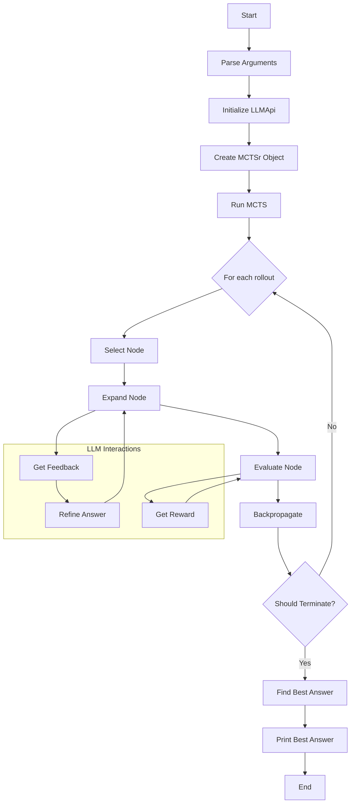

# ganymede

Uses OLLAMA and QWEN2s smollest model for running local.

```
Problem: What is 2 * 16?
Model: qwen2:0.5b-instruct-fp16
Number of rollouts: 10

Rollout 1/10
Rollout 2/10
Rollout 3/10
Rollout 4/10
Rollout 5/10
Rollout 6/10
Rollout 7/10
Rollout 8/10
Rollout 9/10
Rollout 10/10

Best answer: The result of \(2\) times \(16\) is \(32\).
```


my budget smol implementation of q* : 
[https://arxiv.org/abs/2406.07394](https://arxiv.org/abs/2406.07394)

Just supply the problem in a .txt and the number of rollouts. 

```commandline
python ganymede.py --model "qwen2:0.5b-instruct-fp16" --rollouts 10 --problem_file problem.txt

```


